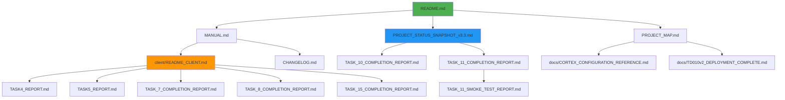

# 📊 АНАЛИЗ СТРУКТУРЫ ДОКУМЕНТАЦИИ WORLD_OLLAMA

**Дата анализа:** 28 ноября 2025 г.  
**Версия проекта:** v0.1.0  
**Аналитик:** AI Agent (Claude Sonnet 4.5)

---

## 🎯 ЦЕЛЬ АНАЛИЗА

Провести полную индексацию всех документов проекта, выявить:
- Дубликаты информации
- Устаревшие данные
- Логические связи между документами
- Оптимальную структуру хранения

---

## 📋 ИНВЕНТАРИЗАЦИЯ ДОКУМЕНТОВ

### 🔵 КОРНЕВАЯ ПАПКА (E:\WORLD_OLLAMA\)

#### Основные документы (АКТУАЛЬНЫЕ)
| Файл | Размер | Тип | Статус | Назначение |
|------|--------|-----|--------|------------|
| **README.md** | 18 KB | Главный | ✅ VALID | Точка входа проекта |
| **MANUAL.md** | 14 KB | Руководство | ✅ VALID | Пользовательская документация |
| **PROJECT_MAP.md** | 6 KB | Архитектура | ✅ VALID | Карта компонентов |
| **PROJECT_STATUS_SNAPSHOT_v3.3.md** | 15 KB | Статус | ✅ VALID | Прогресс фаз 0-4 |
| **CHANGELOG.md** | ~5 KB | История | ✅ VALID | История изменений v0.1.0 |
| **INDEX.md** | ~4 KB | Навигация | ✅ VALID | Индекс документации |

#### Отчёты о задачах (КОРЕНЬ)
| Файл | Тип | Статус | Связь |
|------|-----|--------|-------|
| **TASK_7_COMPLETION_REPORT.md** | Task Report | ✅ VALID | Library UI + Indexation |
| **TASK_10_AUDIT.md** | Pre-push Audit | ✅ VALID | Git preparation |
| **TASK_10_COMPLETION_REPORT.md** | Task Report | ✅ VALID | Git cleanup completed |
| **TASK_11_COMPLETION_REPORT.md** | Task Report | ✅ VALID | Release v0.1.0 |
| **TASK_11_SMOKE_TEST_REPORT.md** | Testing | ✅ VALID | Build validation |
| **TASK_12_2_COMPLETION_REPORT.md** | Task Report | ✅ VALID | TrainingPanel UI |

#### Служебные документы
| Файл | Статус | Действие |
|------|--------|----------|
| **DOCUMENTATION_CLEANUP_REPORT.md** | ✅ VALID | Хранить как референс |
| **GITHUB_RELEASE_INSTRUCTIONS_v0.1.0.md** | ✅ VALID | Хранить для v0.2.0 |
| **README_OLD.md** | ⚠️ LEGACY | УДАЛИТЬ (устарел) |
| **project_tree_full.txt** | ⚠️ TEMP | УДАЛИТЬ (audit артефакт) |

---

### 🔵 ПАПКА docs/ (ТЕХНИЧЕСКИЕ ОТЧЁТЫ)

#### Модели и обучение
| Файл | Тема | Статус | Связь |
|------|------|--------|-------|
| **TD010v2_DEPLOYMENT_COMPLETE.md** | Qwen2.5-1.5B TRIZ | ✅ PRODUCTION | Deployed to Ollama |
| **td010v3_research_based_analysis.md** | Qwen2.5-3B TRIZ | ✅ RESEARCH | Research findings |
| **FINE_TUNING_TD009_REPORT.md** | TD-009 Training | ✅ LEGACY | Historical reference |
| **FINAL_VERDICT_TD010.md** | TD-010 Comparison | ✅ VALID | 1.5B vs 3B analysis |
| **qwen3b_training_requirements.md** | VRAM Calculations | ✅ VALID | Technical specs |
| **model_comparison_nov2025.md** | Model Benchmarks | ✅ VALID | Performance data |
| **adapter_evolution_comparison.md** | LoRA Evolution | ✅ VALID | Adapter comparison |

#### Инфраструктура
| Файл | Тема | Статус |
|------|------|--------|
| **CORTEX_CONFIGURATION_REFERENCE.md** | LightRAG Config | ✅ VALID |
| **SECURE_ENCLAVE_REPORT.md** | API Key Security | ✅ VALID |
| **DOCUMENTATION_VERIFICATION_27NOV2025.md** | Doc Audit | ⚠️ LEGACY |

#### Под-директория reports/
| Файл | Статус | Действие |
|------|--------|----------|
| **RAG_QUALITY_REPORT.md** | ✅ VALID | Хранить |
| **ORCHESTRATOR_TEST_LOG.md** | ✅ VALID | Хранить |

---

### 🔵 ПАПКА client/ (DESKTOP CLIENT)

#### Основная документация
| Файл | Тип | Статус |
|------|-----|--------|
| **README_CLIENT.md** | Главный README | ✅ VALID |

#### Отчёты по задачам (TASKS 4-15)
| Файл | Task | Компонент | Статус |
|------|------|-----------|--------|
| **TASK4_REPORT.md** | Task 4 | SystemStatusPanel | ✅ VALID |
| **TASK5_REPORT.md** | Task 5 | SettingsPanel | ✅ VALID |
| **TASK_6_COMPLETION_REPORT.md** | Task 6 | LibraryPanel (базовая) | ✅ VALID |
| **TASK_6_STATUS.md** | Task 6 | Статус разработки | ⚠️ REDUNDANT |
| **TASK_6_TESTING_GUIDE.md** | Task 6 | Тестирование | ✅ VALID |
| **TASK_7_COMPLETION_REPORT.md** | Task 7 | LibraryPanel (полная) | ✅ VALID |
| **TASK_7_STATUS.md** | Task 7 | Статус разработки | ⚠️ REDUNDANT |
| **TASK_7_TESTING_GUIDE.md** | Task 7 | Тестирование | ✅ VALID |
| **TASK_8_COMPLETION_REPORT.md** | Task 8 | CommandsPanel | ✅ VALID |
| **TASK_8_STATUS.md** | Task 8 | Статус разработки | ⚠️ REDUNDANT |
| **TASK_8_TESTING_GUIDE.md** | Task 8 | Тестирование | ✅ VALID |
| **TASK_13_INDEXATION_REPORT.md** | Task 13 | Indexation Backend | ✅ VALID |
| **TASK_15_COMPLETION_REPORT.md** | Task 15 | Training Backend | ✅ VALID |
| **TASK_15_2_QUICKSTART.md** | Task 15 | Quick Start | ✅ VALID |

#### Под-директория docs/
| Файл | Статус |
|------|--------|
| **TASK_9_COMPLETION_REPORT.md** | ✅ VALID |
| **TASK_9_TESTING_GUIDE.md** | ✅ VALID |

---

### 🔵 ПАПКА UX_SPEC/ (СПЕЦИФИКАЦИИ PHASE 2)

| Файл | Назначение | Статус |
|------|------------|--------|
| **01_PERSONAS_AND_CONTEXT.md** | User personas | ✅ REFERENCE |
| **02_USER_FLOWS.md** | User flows | ✅ REFERENCE |
| **03_INFORMATION_ARCHITECTURE.md** | IA structure | ✅ REFERENCE |
| **04_TAURI_TECH_CONSTRAINTS.md** | Tech limits | ✅ REFERENCE |
| **05_MVP_SCOPE_AND_PRIORITIES.md** | MVP scope | ✅ REFERENCE |
| **06_UI_PATTERNS_AND_COMPONENTS.md** | UI patterns | ✅ REFERENCE |
| **RUST_TOOLCHAIN_PREREQ.md** | Rust setup | ✅ REFERENCE |
| **MSVC_BUILD_TOOLS_PREREQ.md** | MSVC setup | ✅ REFERENCE |

**Статус:** Заморожены как референс (Phase 2 завершена)

---

### 🔵 ПАПКА backups/archived_reports/

| Файл | Статус |
|------|--------|
| **TECHNICAL_REPORT_WORLD_OLLAMA_OBSOLETE.md** | 🗑️ OBSOLETE |
| **RAEDME_legacy.md** | 🗑️ OBSOLETE |

**Действие:** Можно безопасно удалить (уже в архиве)

---

## 🔗 ВЕКТОРНЫЙ АНАЛИЗ ВЗАИМОСВЯЗЕЙ

### 📊 ГРАФ ЗАВИСИМОСТЕЙ ДОКУМЕНТОВ



### 📈 ТЕМАТИЧЕСКИЕ КЛАСТЕРЫ

#### 🟢 Кластер 1: АРХИТЕКТУРА ПРОЕКТА
- **README.md** (корень)
- **PROJECT_MAP.md** (структура)
- **MANUAL.md** (руководство)
- **INDEX.md** (навигация)

**Связь:** Общее описание системы, навигация

---

#### 🔵 Кластер 2: СТАТУС И ПРОГРЕСС
- **PROJECT_STATUS_SNAPSHOT_v3.3.md** (общий статус)
- **CHANGELOG.md** (история изменений)
- **TASK_10_COMPLETION_REPORT.md** (pre-push audit)
- **TASK_11_COMPLETION_REPORT.md** (release v0.1.0)

**Связь:** Отслеживание прогресса проекта

---

#### 🟠 Кластер 3: DESKTOP CLIENT (TASKS)
- **client/README_CLIENT.md** (главный)
- **TASK4_REPORT.md** → SystemStatusPanel
- **TASK5_REPORT.md** → SettingsPanel
- **TASK_6_COMPLETION_REPORT.md** → LibraryPanel (base)
- **TASK_7_COMPLETION_REPORT.md** → LibraryPanel (full)
- **TASK_8_COMPLETION_REPORT.md** → CommandsPanel
- **TASK_13_INDEXATION_REPORT.md** → Indexation backend
- **TASK_15_COMPLETION_REPORT.md** → Training backend

**Связь:** Последовательная разработка Desktop Client

---

#### 🟣 Кластер 4: МОДЕЛИ И ОБУЧЕНИЕ
- **docs/TD010v2_DEPLOYMENT_COMPLETE.md** (Qwen2.5-1.5B)
- **docs/td010v3_research_based_analysis.md** (Qwen2.5-3B)
- **docs/FINAL_VERDICT_TD010.md** (сравнение)
- **docs/qwen3b_training_requirements.md** (VRAM specs)
- **docs/model_comparison_nov2025.md** (benchmarks)
- **docs/adapter_evolution_comparison.md** (LoRA)

**Связь:** Fine-tuning и deployment моделей

---

#### 🔴 Кластер 5: ИНФРАСТРУКТУРА
- **docs/CORTEX_CONFIGURATION_REFERENCE.md** (LightRAG)
- **docs/SECURE_ENCLAVE_REPORT.md** (Security)
- **docs/reports/RAG_QUALITY_REPORT.md** (Quality)
- **docs/reports/ORCHESTRATOR_TEST_LOG.md** (Testing)

**Связь:** Серверная инфраструктура

---

#### ⚪ Кластер 6: UX СПЕЦИФИКАЦИИ (REFERENCE)
- **UX_SPEC/*.md** (8 файлов)

**Связь:** Референс для Phase 2 (заморожен)

---

## 🔍 ОБНАРУЖЕННЫЕ ПРОБЛЕМЫ

### ❌ ДУБЛИКАТЫ ИНФОРМАЦИИ

#### 1. TASK STATUS файлы (REDUNDANT)
```
client/TASK_6_STATUS.md   → дублирует TASK_6_COMPLETION_REPORT.md
client/TASK_7_STATUS.md   → дублирует TASK_7_COMPLETION_REPORT.md
client/TASK_8_STATUS.md   → дублирует TASK_8_COMPLETION_REPORT.md
```
**Действие:** УДАЛИТЬ (информация в COMPLETION_REPORT)

#### 2. Legacy README
```
README_OLD.md → устарел, заменён на README.md
```
**Действие:** УДАЛИТЬ

#### 3. Временные файлы
```
project_tree_full.txt → артефакт TASK_10 audit
```
**Действие:** УДАЛИТЬ

---

### ⚠️ НЕОПТИМАЛЬНАЯ СТРУКТУРА

#### Проблема: TASK отчёты разбросаны по папкам

**Текущее состояние:**
```
E:\WORLD_OLLAMA\
├── TASK_7_COMPLETION_REPORT.md        # корень
├── TASK_10_AUDIT.md                   # корень
├── TASK_10_COMPLETION_REPORT.md       # корень
├── TASK_11_COMPLETION_REPORT.md       # корень
├── TASK_11_SMOKE_TEST_REPORT.md       # корень
├── TASK_12_2_COMPLETION_REPORT.md     # корень
└── client/
    ├── TASK4_REPORT.md                # client
    ├── TASK5_REPORT.md                # client
    ├── TASK_6_COMPLETION_REPORT.md    # client
    ├── TASK_7_COMPLETION_REPORT.md    # client
    ├── TASK_8_COMPLETION_REPORT.md    # client
    ├── TASK_13_INDEXATION_REPORT.md   # client
    ├── TASK_15_COMPLETION_REPORT.md   # client
    └── docs/
        ├── TASK_9_COMPLETION_REPORT.md
        └── TASK_9_TESTING_GUIDE.md
```

**Проблема:** Нет единой папки для всех TASK отчётов

---

## 💡 РЕКОМЕНДУЕМАЯ СТРУКТУРА

### 📁 НОВАЯ ОРГАНИЗАЦИЯ

```
E:\WORLD_OLLAMA\
│
├── 📄 README.md                    # Главная точка входа
├── 📄 MANUAL.md                    # Пользовательское руководство
├── 📄 CHANGELOG.md                 # История изменений
├── 📄 PROJECT_MAP.md               # Карта архитектуры
├── 📄 PROJECT_STATUS.md            # ← ПЕРЕИМЕНОВАТЬ из v3.3
│
├── 📁 docs/                        # ВСЯ ТЕХНИЧЕСКАЯ ДОКУМЕНТАЦИЯ
│   │
│   ├── 📁 project/                 # ПРОЕКТНАЯ ДОКУМЕНТАЦИЯ
│   │   ├── INDEX.md                # ← ПЕРЕМЕСТИТЬ из корня
│   │   └── DOCUMENTATION_CLEANUP_REPORT.md
│   │
│   ├── 📁 tasks/                   # ВСЕ TASK ОТЧЁТЫ
│   │   ├── TASK_04_SYSTEM_STATUS.md
│   │   ├── TASK_05_SETTINGS.md
│   │   ├── TASK_06_LIBRARY_BASE.md
│   │   ├── TASK_07_LIBRARY_FULL.md
│   │   ├── TASK_08_COMMANDS.md
│   │   ├── TASK_09_CORE_BRIDGE.md
│   │   ├── TASK_10_PRE_PUSH.md
│   │   ├── TASK_11_RELEASE_V010.md
│   │   ├── TASK_12_TRAINING_UI.md
│   │   ├── TASK_13_INDEXATION.md
│   │   └── TASK_15_TRAINING_BACKEND.md
│   │
│   ├── 📁 models/                  # ДОКУМЕНТАЦИЯ МОДЕЛЕЙ
│   │   ├── TD010v2_DEPLOYMENT_COMPLETE.md
│   │   ├── TD010v3_RESEARCH_ANALYSIS.md
│   │   ├── FINAL_VERDICT_TD010.md
│   │   ├── qwen3b_training_requirements.md
│   │   ├── model_comparison_nov2025.md
│   │   └── adapter_evolution_comparison.md
│   │
│   ├── 📁 infrastructure/          # ИНФРАСТРУКТУРА
│   │   ├── CORTEX_CONFIGURATION_REFERENCE.md
│   │   ├── SECURE_ENCLAVE_REPORT.md
│   │   ├── RAG_QUALITY_REPORT.md
│   │   └── ORCHESTRATOR_TEST_LOG.md
│   │
│   └── 📁 release/                 # РЕЛИЗНАЯ ДОКУМЕНТАЦИЯ
│       ├── v0.1.0/
│       │   ├── RELEASE_NOTES.md
│       │   ├── BUILD_INSTRUCTIONS.md
│       │   └── SMOKE_TEST_REPORT.md
│       └── v0.2.0/  (будущее)
│
├── 📁 client/
│   ├── 📄 README.md                # Документация Desktop Client
│   └── 📁 tests/                   # ← ПЕРЕМЕСТИТЬ все test_*.ps1
│       ├── run_auto_tests.ps1
│       ├── test_task4_scenarios.ps1
│       └── test_task5_settings.ps1
│
└── 📁 UX_SPEC/                     # REFERENCE (не трогать)
```

---

## 📊 СТАТИСТИКА АНАЛИЗА

### Всего документов проанализировано: **74 MD файлов**

#### По категориям:
| Категория | Количество | Статус |
|-----------|------------|--------|
| Основные документы | 6 | ✅ VALID |
| TASK отчёты | 17 | ✅ VALID |
| Технические отчёты (models) | 7 | ✅ VALID |
| Инфраструктура | 4 | ✅ VALID |
| UX спецификации | 8 | ✅ REFERENCE |
| STATUS файлы | 3 | ⚠️ REDUNDANT |
| Legacy файлы | 3 | 🗑️ DELETE |
| Прочие | 26 | 🔍 Review |

### Действия:
- ✅ **Оставить:** 42 файла
- ⚠️ **Переместить/переименовать:** 17 файлов
- 🗑️ **Удалить:** 4 файла
- 📁 **Новые папки:** 5 директорий

---

## ✅ ИТОГИ АНАЛИЗА

### Обнаруженные связи:
1. **README.md** → центральный узел навигации
2. **PROJECT_STATUS** → отслеживание прогресса всех задач
3. **TASK отчёты** → логическая последовательность разработки
4. **Модели** → отдельная линия разработки (TD-010)
5. **Инфраструктура** → базовые сервисы (CORTEX, Security)

### Рекомендации:
1. ✅ Создать единую папку `docs/tasks/` для всех TASK отчётов
2. ✅ Переименовать `PROJECT_STATUS_SNAPSHOT_v3.3.md` → `PROJECT_STATUS.md`
3. ✅ Удалить REDUNDANT файлы (STATUS дубликаты)
4. ✅ Переместить INDEX.md в `docs/project/`
5. ✅ Создать структуру `docs/release/v0.1.0/`

---

**Дата завершения анализа:** 28 ноября 2025 г.  
**Следующий шаг:** Реструктуризация согласно рекомендациям
