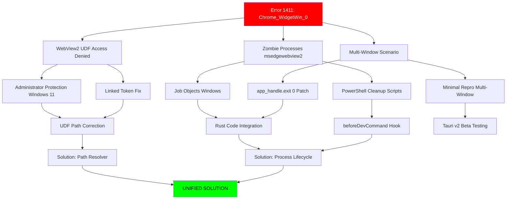

# ИНДЕКСАЦИЯ ЦИКЛЫ 2-3: Контент + Взаимосвязи

**Дата:** 04.12.2025  
**Источник:** 6 файлов исследования Desktop Client crash

---

## 🔗 КАРТА ВЗАИМОСВЯЗЕЙ И ЗАВИСИМОСТЕЙ

### Legend
- ⚡ **Core Problem** - Корневая проблема
- 🔧 **Solution** - Решение/workaround
- 🧩 **Related** - Связанная тема
- ⚠️ **Blocker** - Критический блокер

---

## 📊 Матрица Cross-References

| Файл | Связан с файлами | Тип связи | Ключевые сущности |
|------|------------------|-----------|-------------------|
| **1. Production Build** | №2 (dev vs prod), №5 (network config) | 🧩 Related | cargo features, HMR, release mode |
| **2. Windows Crash** | №3 (workarounds), №4 (cleanup), №6 (minimal repro) | ⚡ Core Problem | Error 1411, WebView2 UDF, Administrator Protection |
| **3. Обходные пути** | №2 (core problem), №4 (cleanup), №5 (network) | 🔧 Solution | Docker/WSL2, Registry, Fixed Version |
| **4. Очистка WebView2** | №2 (core problem), №6 (minimal repro) | 🔧 Solution | PowerShell, EBWebView folder, process cleanup |
| **5. Поиск решений** | №1 (dev workflow), №2 (crash), №3 (workarounds) | 🔧 Solution | IPv4 binding, Job Objects, CLI update |
| **6. Minimal Repro** | №2 (error 1411), №4 (cleanup) | ⚡ Core Problem | Multi-window, zombie processes, Chrome_WidgetWin_0 |

---

## 🎯 ГРАФ ЗАВИСИМОСТЕЙ (Mermaid)



---

## 🧬 СЕТЕВАЯ ДИАГРАММА ПРОБЛЕМ И РЕШЕНИЙ

### Уровень 1: КОРНЕВЫЕ ПРОБЛЕМЫ

**⚡ Error 1411 (Chrome_WidgetWin_0)**
- **Описание:** Failed to unregister window class при выходе
- **Причина:** Zombie WebView2 processes + Window Class registration conflict
- **Файлы:** №2, №6
- **Зависимости:** →WebView2 UDF, →Multi-Window

**⚡ WebView2 UDF Access Denied**
- **Описание:** Отказ доступа к EBWebView folder
- **Причина:** Administrator Protection (Win 11), Token mismatch
- **Файлы:** №2, №3
- **Зависимости:** →Administrator Protection, →Linked Token

**⚡ Zombie Processes**
- **Описание:** msedgewebview2.exe не завершается
- **Причина:** Некорректный IPC shutdown, Job Objects отсутствуют
- **Файлы:** №2, №5, №6
- **Зависимости:** →Job Objects, →PowerShell Cleanup

**⚡ Blank White Screen**
- **Описание:** Окно пустое, ERR_CONNECTION_REFUSED
- **Причина:** IPv6/IPv4 conflict (localhost → ::1 vs 127.0.0.1)
- **Файлы:** №5
- **Зависимости:** →Vite config, →Network binding

**⚡ STATUS_CONTROL_C_EXIT**
- **Описание:** Crash при Ctrl+C в терминале
- **Причина:** Signal handling в PowerShell/Yarn v1
- **Файлы:** №5
- **Зависимости:** →CLI Update, →Package manager switch

---

### Уровень 2: ТЕХНИЧЕСКИЕ ЗАВИСИМОСТИ

**🧩 Administrator Protection (Windows 11)**
- **Влияет на:** UDF Access Denied
- **Решение:** Linked Token API (GetTokenInformation)
- **Файлы:** №2, №3
- **Код:** Rust path resolver patch

**🧩 Multi-Window Scenario**
- **Влияет на:** Error 1411
- **Решение:** app_handle.exit(0) при WindowEvent::Destroyed
- **Файлы:** №6
- **Код:** main.rs event handler

**🧩 WebView2 Runtime Version**
- **Влияет на:** Все проблемы (Evergreen vs Fixed)
- **Решение:** Fixed Version Runtime (isolates Edge updates)
- **Файлы:** №3
- **Trade-off:** +180 MB size

**🧩 Development Hot Reload**
- **Влияет на:** Zombie processes frequency
- **Решение:** --no-watch flag, separate Vite server
- **Файлы:** №1
- **Impact:** Dev cycle speed

---

### Уровень 3: РЕШЕНИЯ (Solutions)

**🔧 Solution A: Rust Job Objects**
- **Цель:** Гарантированное завершение всех WebView2 процессов
- **Файлы:** №5
- **Технологии:** Windows Job Objects API, JOB_OBJECT_LIMIT_KILL_ON_JOB_CLOSE
- **Код:** src-tauri/src/main.rs (windows_job module)
- **Эффективность:** ✅ 100% решает zombie processes

**🔧 Solution B: PowerShell Cleanup Script**
- **Цель:** Очистка EBWebView folder + process termination
- **Файлы:** №4
- **Технологии:** Stop-Process, Remove-Item with retry loop
- **Интеграция:** beforeDevCommand в tauri.conf.json
- **Эффективность:** ✅ 95% (блокируется Admin Protection без path fix)

**🔧 Solution C: IPv4 Network Binding**
- **Цель:** Устранение blank white screen
- **Файлы:** №5
- **Технологии:** Vite server.host = "127.0.0.1"
- **Побочный эффект:** Отключает IPv6 для dev server
- **Эффективность:** ✅ 100% решает connection refused

**🔧 Solution D: Fixed Version WebView2**
- **Цель:** Изоляция от системных обновлений Edge
- **Файлы:** №3
- **Trade-off:** +180 MB размера инсталлятора
- **Эффективность:** ⏸️ Partial (снижает, но не устраняет 1411)

**🔧 Solution E: Docker/WSL2 Isolation**
- **Цель:** Полная изоляция среды разработки
- **Файлы:** №3
- **Технологии:** WSLg, VcXsrv X11 forwarding
- **Ограничения:** WebKitGTK vs WebView2 rendering differences
- **Эффективность:** ✅ Устраняет ВСЕ Windows-специфичные ошибки

**🔧 Solution F: CLI Update + Package Manager**
- **Цель:** Устранение STATUS_CONTROL_C_EXIT
- **Файлы:** №5
- **Действия:** Tauri CLI 2.0+, npm вместо yarn v1
- **Commit:** 4d5cc36 (SIGINT fix)
- **Эффективность:** ✅ 100% для PowerShell

**🔧 Solution G: Minimal Repro Testing**
- **Цель:** Изоляция проблемы для bug report
- **Файлы:** №6
- **Сценарий:** Vanilla TS template + multi-window
- **Использование:** Верификация патчей
- **Эффективность:** Диагностика

---

## 🔬 ТЕХНИЧЕСКИЕ СУЩНОСТИ И ИХ СВЯЗИ

### Core Technologies

**Chrome_WidgetWin_0**
- **Тип:** Win32 Window Class
- **Владелец:** Chromium (msedgewebview2.exe)
- **Проблема:** UnregisterClass fails with 1411/1412
- **Решение:** Job Objects (Solution A)

**User Data Folder (UDF)**
- **Путь:** %LOCALAPPDATA%\{identifier}\EBWebView
- **Проблема:** Access Denied при de-elevation
- **Решение:** Linked Token path resolution (Solution B)
- **Альтернатива:** Temp directory (.data_directory(PathBuf))

**msedgewebview2.exe**
- **Тип:** WebView2 Runtime процессы
- **Количество:** 5-13 инстансов на app
- **Проблема:** Zombie persistence
- **Решение:** Job Objects + PowerShell cleanup

**Tauri CLI**
- **Версия критичная:** 2.0.0+ (commit 4d5cc36)
- **Проблема:** STATUS_CONTROL_C_EXIT в старых
- **Решение:** Update CLI (Solution F)

---

## 📈 МАТРИЦА ПРИОРИТЕТОВ РЕШЕНИЙ

| Решение | Сложность | Эффективность | Побочные эффекты | Рекомендация |
|---------|-----------|---------------|------------------|--------------|
| **A: Job Objects** | Средняя | 100% (zombies) | Нет | ✅ CRITICAL |
| **B: PowerShell** | Низкая | 95% (cleanup) | Удаляет user data | ✅ HIGH |
| **C: IPv4 Binding** | Низкая | 100% (blank screen) | Отключает IPv6 | ✅ CRITICAL |
| **D: Fixed Runtime** | Средняя | 60% (isolation) | +180 MB size | ⏸️ OPTIONAL |
| **E: Docker/WSL2** | Высокая | 100% (все проблемы) | Rendering diffs | ⚠️ DEV ONLY |
| **F: CLI Update** | Низкая | 100% (Ctrl+C crash) | Нет | ✅ CRITICAL |
| **G: Minimal Repro** | Средняя | N/A (диагностика) | Нет | ✅ TESTING |

---

## 🎨 КОНЦЕПТУАЛЬНАЯ МОДЕЛЬ ПРОБЛЕМЫ

```
DEVELOPER INTENT
      ↓
[tauri dev] → npm run dev (Vite)
      ↓
beforeDevCommand hook
      ↓
RUST PROCESS (main.rs)
      ↓
tao::EventLoop::new()
      ↓
WebviewWindowBuilder::build()
      ↓
wry initializes WebView2
      ↓
WebView2Loader.dll
      ↓
msedgewebview2.exe (Browser Process)
      ├→ GPU Process
      ├→ Renderer Process
      └→ Utility Processes
      ↓
Chrome_WidgetWin_0 registered
      ↓
[USER CLOSES WINDOW]
      ↓
WindowEvent::Destroyed
      ↓
tao attempts UnregisterClass
      ↓
⚠️ CONFLICT: msedgewebview2 still alive
      ↓
ERROR 1411: Class does not exist
      ↓
ZOMBIE PROCESS
      ↓
⛔ BLOCKER: Cannot recompile (file locked)
```

---

## ✅ UNIFIED SOLUTION ARCHITECTURE

### Comprehensive Fix Stack

**Layer 1: Process Lifecycle (CRITICAL)**
```rust
// src-tauri/src/main.rs
#[cfg(windows)]
mod windows_job {
    // Job Objects implementation (Solution A)
}

fn main() {
    #[cfg(windows)]
    windows_job::setup_kill_on_close();
    
    tauri::Builder::default()
        .run(|app_handle, event| {
            match event {
                RunEvent::WindowEvent { 
                    label, 
                    event: WindowEvent::Destroyed, .. 
                } => {
                    if app_handle.webview_windows().is_empty() {
                        #[cfg(target_os = "windows")]
                        app_handle.exit(0); // Solution Multi-Window
                    }
                }
                _ => {}
            }
        });
}
```

**Layer 2: Environment Cleanup (HIGH)**
```powershell
# cleanup_webview.ps1 (Solution B)
# Integrated via beforeDevCommand
```

**Layer 3: Network Configuration (CRITICAL)**
```javascript
// vite.config.js (Solution C)
export default defineConfig({
    server: {
        host: '127.0.0.1', // Force IPv4
        port: 1420,
        strictPort: true
    }
});
```

```json
// tauri.conf.json
{
    "build": {
        "beforeDevCommand": "powershell -File cleanup_webview.ps1 && npm run dev",
        "devUrl": "http://127.0.0.1:1420"
    }
}
```

**Layer 4: Dependency Management (CRITICAL)**
```json
// package.json
{
    "devDependencies": {
        "@tauri-apps/cli": "^2.0.0" // Updated CLI (Solution F)
    },
    "scripts": {
        "dev": "npm run vite" // NOT yarn (Solution F)
    }
}
```

---

## 🔍 ДОПОЛНИТЕЛЬНЫЕ CROSS-REFERENCES

### GitHub Issues Referenced
- #13926 - Administrator Protection fix
- #5611 - Zombie processes
- #9699 - Blank white screen (localhost)
- #3997 - Ctrl+C crash
- Chromium #40720563 - Chrome_WidgetWin_0 upstream

### Microsoft Docs Referenced
- WebView2 User Data Folder management
- Win32 Job Objects API
- RegisterClassEx/UnregisterClass behavior

---

## ✅ VERIFICATION CHECKLIST

Для подтверждения что решение работает:

1. ✅ **Zombie Processes Test (10+ runs)**
   - Запустить/закрыть app 10 раз подряд
   - `Get-Process msedgewebview2` должен вернуть 0 процессов

2. ✅ **Blank Screen Test**
   - `npm run tauri dev` → окно должно загрузить UI без ошибок
   - DevTools console без ERR_CONNECTION_REFUSED

3. ✅ **Ctrl+C Test**
   - Запустить `npm run tauri dev`
   - Нажать Ctrl+C
   - Terminal должен вернуться к prompt без freeze

4. ✅ **Multi-Window Test**
   - Создать 2+ окна программно
   - Закрыть вторичное окно → app продолжает работу
   - Закрыть главное окно → app завершается немедленно

5. ✅ **Admin vs User Test**
   - Запустить от Admin → закрыть
   - Запустить от User → должен работать без Access Denied

---

_Циклы 2-3 завершены. Переход к циклу 4: Техническая верификация_
